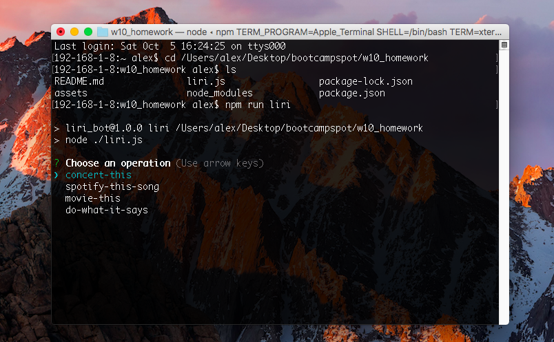
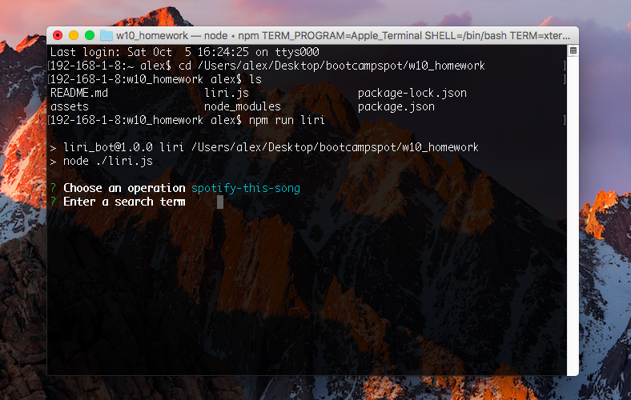
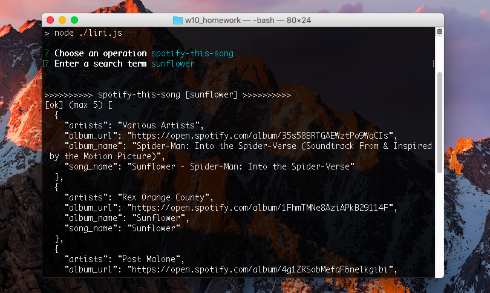

# LIRI Bot

LIRI Bot is a node cli tool to search for things of interest (movies, songs, concerts) and allows user input to determine which APIs to refer call.

The purpose of this exercise was to practice recursion, become familiar with node.js and useful pacakges like axiom, file system and inquirer. Another key learning was on working effectively within a development environment using .env files

## Features

- Single page application
- Responsive
- Create and move burgers from "Delivered" to "Eaten" sections
- New burgers are also added to a "Quick Order" list
- MySQL database for data storage

## Getting Started

Begin by cloning the [LIRI_Bot](https://github.com/alex0n0/LIRI_Bot) repository and install dependencies:

```terminal
git clone https://github.com/alex0n0/eat-da-burger.git
npm install
```

Create a **.env** file and add your database credentials:

```javascript
SPOTIFY_ID=your-spotify-id
SPOTIFY_SECRET=your-spotify-secret
OMDB_KEY=your-omdb-key
BANDS_IN_TOWN_KEY=your-bands-in-town-key
```

Run the application to see it in action:

```terminal
npm run liri
NOTE: Do not delete (assets > random.txt)
NOTE: (assets > log.txt) will be generated when (liri.js) is run
```



Follow the prompts that appear.

NOTE: Data validation prevents submission of empty inputs. You can enter [spaces] to test out fallback defaults.



Results will be displayed in the terminal and also appended to log.txt which will be generated if it does not exist.



## Built With

Node.js

Node Packages

- Axios
- Filesystem
- Inquirer
- Node-spotify-api
- Dotenv

## License

This project is licensed under the terms of the [MIT](https://github.com/alex0n0/LIRI_Bot/blob/master/LICENSE) license.
