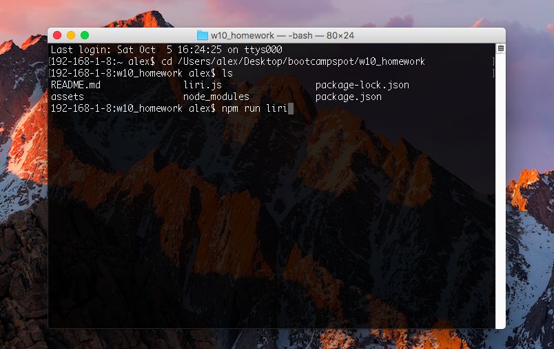

# LIRI Bot

LIRI Bot is a node cli tool to search for things of interest (movies, songs, concerts) and allows user input to determine which APIs to refer call.

The purpose of this exercise was to practice recursion, become familiar with node.js and useful pacakges like axiom, file system and inquirer. Another key learning was on working effectively within a development environment using .env files

## high level overview of app organisation

The main script (liri.js) exists in the root of the project.
Do not delete (assets > random.txt)
(assets > log.txt) will be generated when (liri.js) is run

## Instructions

**Screenshots on user inputs are provided in (assets) folder**

add your keys

start to finish instrctions on how to run the app
Ensure node.js is installed on your device.

Then go to the root of the project folder and enter the following command/s in the terminal to run LIRI Bot:
,,,
npm run liri OR node liri
,,,

Follow the prompts to

NOTE: Data validation prevents submission of empty inputs. You can enter [spaces]
    follow prompts

screenshots, gifs or videos of functioning app

## Deployed Version

Deployed version does not exist. You will need to clone this repo and 

### Technologies Used

node js

axiom
node-spotify-api
inquirer
fs

